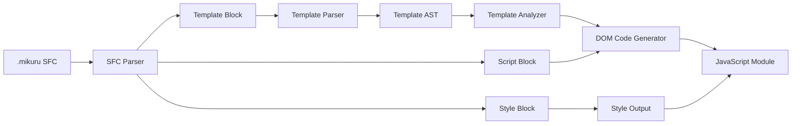

# Mikuru Design

Mikuruは、Vue風の記述体験とSvelte風のコンパイル戦略を組み合わせる。API表面は親しみやすく保ちつつ、実行時の抽象化はできるだけ薄くする。

## 設計原則

1. 書くときはVueに近く、動くときは生成済みDOMコードに近づける。
2. 仮想DOMを前提にしない。
3. ランタイムはリアクティビティと最小ヘルパーに寄せる。
4. コンパイラはテンプレートから依存関係と更新箇所を明示的に抽出する。
5. Vue互換ではなく、Vueに学んだ独自構文として仕様化する。

## 全体パイプライン

## コンパイラの責務

### SFC Parser

`.mikuru` ファイルを `<template>`、`<script>`、`<style>` のブロックに分割する。MVPでは各ブロックは最大1つずつとし、重複や未知ブロックは明示的なエラーにする。

### Template Parser

テンプレートをHTMLに近いASTへ変換し、Mikuru固有の構文をノード情報として保持する。v1の対象は、要素、テキスト、補間、イベント、属性バインド、`v-if` / `v-else-if` / `v-else`、`v-show`、`v-for`、`v-model`、slot、子コンポーネント呼び出しに限定する。

### Dependency Analyzer

補間やディレクティブ式を検証し、テンプレート上の動的バインディング一覧を記録する。v1では生成処理もASTを直接走査するため、Analyzerは公開APIとテストで仕様を確認する補助的な責務を持つ。

### DOM Code Generator

テンプレートASTと`<script>`から、`document.createElement`、`textContent`、`setAttribute`、`addEventListener`、`effect` を使うJavaScript moduleを生成する。`defineProps` / `defineEmits` はここでコンパイル専用マクロとして変換する。

## ランタイムの責務

ランタイムは次に限定する。

- `ref`: `.value` の読み取りと書き込みを追跡する。
- `computed`: 依存する `ref` から派生値を作る。
- `effect`: 依存する値が変わったときに更新関数を再実行する。
- DOM補助関数: 必要になった場合のみ、生成コードを読みやすくする小さな関数を提供する。

## Vueから借りるもの

- SFCの読みやすさ。
- テンプレートの宣言性。
- `ref`、`computed`、`effect` に近いComposition API風の状態モデル。
- `@event`、`:attr`、`v-if`、`v-for` のような短いテンプレート記法。

## Vueと違うもの

- Vueコンポーネント互換を目指さない。
- 仮想DOMとランタイムパッチングを中心にしない。
- テンプレート構文の全機能を最初から持たない。
- `script setup` 互換や高度なテンプレート型推論は後続課題にする。

## Svelteから借りるもの

- コンパイル時にテンプレートを解析して更新コードを生成する考え方。
- 実行時の抽象化を減らし、生成物を小さくする方針。
- コンポーネント単位で依存関係を静的に見つける発想。

## Svelteと違うもの

- Svelte構文互換を目指さない。
- 代入ベースのリアクティビティではなく、初期MVPでは `ref` ベースの明示的リアクティビティを採用する。
- Vueに近いテンプレートディレクティブを優先する。

## v1の非目標

- SSR
- hydration
- transition
- devtools
- 完全なVue互換
- 完全なテンプレート型チェック
- scoped CSSの完全なCSS selector対応

## 判断基準

新しい機能を入れるときは、次の順で判断する。

1. `.mikuru` を読む人にとって自然か。
2. コンパイラが静的に理解できるか。
3. ランタイムを大きくしすぎないか。
4. v1のカウンター、フォーム、親子コンポーネント、小さなリスト表示を複雑にしないか。
