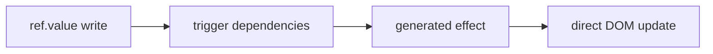

# Reactivity and Lifecycle Design

Mikuru v1では、明示的な `ref` ベースのリアクティビティを採用する。VueのComposition APIに近い書き心地を保ちつつ、コンパイラがDOM更新箇所を生成しやすい形にする。

## API

### `ref`

```js
import { ref } from "mikuru";

const count = ref(0);
count.value += 1;
```

`ref` は `.value` に値を保持するリアクティブな箱を作る。

性質:

- `.value` の読み取り時に、実行中の `effect` へ依存関係を登録する。
- `.value` の書き込み時に、依存する `effect` を再実行する。
- オブジェクトの深いリアクティビティはv1対象外にする。

### `computed`

```js
import { computed, ref } from "mikuru";

const count = ref(0);
const doubled = computed(() => count.value * 2);
```

`computed` は他のリアクティブ値から派生値を作る。getter は `.value` が初めて読まれるまで実行されず、依存値が変わるまでは計算結果をキャッシュする。

書き込み可能な派生値が必要な場合は、`get` / `set` を持つオブジェクトを渡せる。フォームや子コンポーネントの `m-model` と組み合わせると、表示用の値と内部状態を分けやすい。

```js
const first = ref("Mikuru");
const last = ref("Runtime");

const fullName = computed({
  get: () => `${first.value} ${last.value}`,
  set: (nextName) => {
    const [nextFirst = "", nextLast = ""] = nextName.split(" ");
    first.value = nextFirst;
    last.value = nextLast;
  }
});

fullName.value = "Writable Computed";
```

v1での方針:

- 関数で作った返り値は読み取り専用の `.value` を持つ。
- `computed({ get, set })` の返り値は `.value` へ書き込むと `set` を呼ぶ。
- 依存する `ref` が変わったときはdirtyになり、次の `.value` 読み取りで再計算される。
- 依存が変わるまでは同じ `.value` 読み取りでgetterを再実行しない。

### `reactive` and `readonly`

```js
import { reactive, readonly, toRaw } from "mikuru";

const state = reactive({ count: 0, tags: ["runtime"] });
state.count += 1;
state.tags.push("compiler");

const locked = readonly(state);
locked.count = 10; // no-op

toRaw(state);
```

`reactive` はオブジェクトや配列をProxyで包み、propertyの読み取り・書き込み・削除・key列挙を追跡する。ネストしたオブジェクトや配列は読み取り時に同じくProxy化される。`readonly` は同じ読み取り追跡を行うが、書き込みと削除はno-opにする。

補助API:

- `isReactive(value)`
- `isReadonly(value)`
- `isProxy(value)`
- `toRaw(value)`

### Ref helpers

```js
import { isRef, reactive, ref, toRef, toRefs, unref } from "mikuru";

const count = ref(0);
isRef(count); // true
unref(count); // 0

const state = reactive({ count: 0, label: "idle" });
const countRef = toRef(state, "count");
const { label } = toRefs(state);

countRef.value += 1;
label.value = "ready";
```

`unref(value)` は `unwrap(value)` と同じく、ref風の値なら `.value`、通常値ならそのまま返す。`toRef(object, key)` はオブジェクトのpropertyと同期するrefを作り、`toRefs(object)` は列挙可能なown propertyをまとめてref化する。destructuringしても元の `reactive` state との接続を保ちたいときに使う。

### `effect`

```js
import { effect } from "mikuru";

effect(() => {
  button.textContent = String(count.value);
});
```

`effect` はリアクティブ値を読み取り、その値が変わったときに再実行される関数を登録する。

依存値の更新時に実行タイミングを制御したい場合は、scheduler を渡せる。初回だけは同期実行され、以後の更新では scheduler に runner が渡される。

```js
const queue = [];

effect(() => {
  button.textContent = String(count.value);
}, {
  scheduler: (runner) => {
    queue.push(runner);
  }
});

queue.shift()?.();
```

Mikuru also exposes a tiny microtask job queue for the common scheduled effect case:

```js
import { effect, nextTick, queueJob } from "mikuru";

effect(() => {
  button.textContent = String(count.value);
}, { scheduler: queueJob });

count.value += 1;
count.value += 1;

await nextTick();
```

主な用途:

- 補間テキストの更新
- 属性バインドの更新
- `m-if` の表示切り替え
- `m-for` の再描画

## 更新モデル

Mikuruでは、コンパイラがテンプレートから更新単位を作る。ランタイムは「どの値が変わったか」を伝え、生成コードが「どのDOMを更新するか」を知っている状態を目指す。



例:

```mikuru
<template>
  <p>{{ message }}</p>
</template>

<script>
import { ref } from "mikuru";

const message = ref("hello");
</script>
```

生成される更新の考え方:

```js
const message = ref("hello");
const p = document.createElement("p");

effect(() => {
  p.textContent = message.value;
});
```

## 依存関係の扱い

v1では、テンプレート式の依存関係はコンパイル時に粗く抽出する。

```mikuru
<p>{{ userName }}</p>
<button :disabled="isSaving">Save</button>
```

この場合、コンパイラは `userName` と `isSaving` をテンプレート依存として記録する。ただし、最終的な再実行の正しさは `effect` 内で実際に `.value` を読むことで担保する。

## `ref` のアンラップ

テンプレート内では、`ref` を自動的に `.value` として扱う方針にする。

```mikuru
<p>{{ count }}</p>
```

は、生成コードでは概念的に次のように扱う。

```js
effect(() => {
  p.textContent = String(count.value);
});
```

v1では、テンプレートで参照されるトップレベル識別子が `ref` かどうかを厳密に型解析しない。生成コードは `unwrap` ヘルパーを使い、`ref` と通常値のどちらも扱える形にする。

## スケジューリング

リアクティブな `effect` は同期実行する。

- `.value` 書き込み時に依存 `effect` を即時実行する。
- `effect(fn, { scheduler })` は初回を同期実行し、依存値更新時は scheduler に runner を渡す。
- `queueJob(job)` はmicrotaskでjobを実行し、同じjobを同一flush内で重複実行しない。
- `flushJobs()` は保留中のjobを同期的にdrainする。
- `nextTick(fn?)` は保留中のjob flush後に任意のコールバックをmicrotaskで実行する。
- effect全体のバッチングや重複実行の排除は後続課題にする。

## クリーンアップ

v1では、`effect` は停止関数を返し、生成された `mount` は `unmount()` でその停止関数を呼ぶ。これにより、通常のイベントリスナー、条件分岐、繰り返し、子コンポーネントの破棄をコンポーネント単位で管理する。

期待する性質:

- `effect(fn)` は初回に同期実行される。
- 返された停止関数を呼ぶと、以後の依存値更新では再実行されない。
- `mount()` は `{ element, unmount }` を返す。
- `unmount()` は生成コードが登録したeffect停止、イベント解除、子コンポーネント破棄を逆順に実行する。

## Watch and Lifecycle

v1では、アプリ側の実用性を補うために小さな監視・ライフサイクルAPIを提供する。

- `watch(source, cb)` はref風の値、getter、通常値、またはそれらの配列を監視し、変更時にコールバックを呼ぶ。
- `watch(source, cb, { immediate: true })` は現在値で初回コールバックを即時実行する。
- `watch(source, cb, { once: true })` は最初のコールバック後に自動停止する。`immediate` と組み合わせた場合は初回実行だけで停止する。
- `watch` のコールバックは第3引数 `onCleanup(fn)` を受け取り、次のコールバック直前または停止時にcleanupを実行できる。
- `watchEffect(fn)` は実行中に読んだref風の値を監視し、変更時に再実行する。`fn(onCleanup)` の cleanup は次の再実行直前または停止時に呼ばれる。
- `onMounted(fn)`、`onBeforeUnmount(fn)`、`onUnmounted(fn)` はmount中のMikuruコンポーネントに対してコールバックを登録する。`onActivated(fn)` / `onDeactivated(fn)` は `<KeepAlive>` にcacheされたgenerated componentが表示/非表示に戻るタイミングで実行される。
- `provide(key, value)` と `inject(key, fallback?)` は現在mount中のコンポーネントツリーにスコープされ、子コンポーネントは親から提供された値を参照できる。

```js
const stop = watch(count, (next, previous, onCleanup) => {
  const timer = setTimeout(() => {
    console.log(next, previous);
  }, 100);

  onCleanup(() => {
    clearTimeout(timer);
  });
}, { immediate: true });

stop();
```

```js
const stopEffect = watchEffect((onCleanup) => {
  const timer = setTimeout(() => {
    console.log(count.value);
  }, 100);

  onCleanup(() => {
    clearTimeout(timer);
  });
});

stopEffect();
```

## 非目標

- Vue互換の `reactive`
- `reactive` collection types such as `Map` and `Set`
- 生成DOM更新をすべて非同期化すること
- devtools連携
