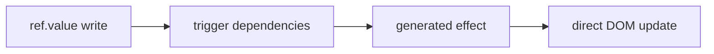

# Reactivity and Lifecycle Design

Mikuru v1では、明示的な `ref` ベースのリアクティビティを採用する。VueのComposition APIに近い書き心地を保ちつつ、コンパイラがDOM更新箇所を生成しやすい形にする。

## API

### `ref`

```js
import { ref } from "mikuru";

const count = ref(0);
count.value += 1;
```

`ref` は `.value` に値を保持するリアクティブな箱を作る。

性質:

- `.value` の読み取り時に、実行中の `effect` へ依存関係を登録する。
- `.value` の書き込み時に、依存する `effect` を再実行する。
- オブジェクトの深いリアクティビティはv1対象外にする。

### `computed`

```js
import { computed, ref } from "mikuru";

const count = ref(0);
const doubled = computed(() => count.value * 2);
```

`computed` は他のリアクティブ値から派生値を作る。

v1での方針:

- 返り値は読み取り専用の `.value` を持つ。
- 依存する `ref` が変わったときに再計算される。
- キャッシュの厳密な最適化は後続課題にする。

### `effect`

```js
import { effect } from "mikuru";

effect(() => {
  button.textContent = String(count.value);
});
```

`effect` はリアクティブ値を読み取り、その値が変わったときに再実行される関数を登録する。

主な用途:

- 補間テキストの更新
- 属性バインドの更新
- `v-if` の表示切り替え
- `v-for` の再描画

## 更新モデル

Mikuruでは、コンパイラがテンプレートから更新単位を作る。ランタイムは「どの値が変わったか」を伝え、生成コードが「どのDOMを更新するか」を知っている状態を目指す。



例:

```mikuru
<template>
  <p>{{ message }}</p>
</template>

<script>
import { ref } from "mikuru";

const message = ref("hello");
</script>
```

生成される更新の考え方:

```js
const message = ref("hello");
const p = document.createElement("p");

effect(() => {
  p.textContent = message.value;
});
```

## 依存関係の扱い

v1では、テンプレート式の依存関係はコンパイル時に粗く抽出する。

```mikuru
<p>{{ userName }}</p>
<button :disabled="isSaving">Save</button>
```

この場合、コンパイラは `userName` と `isSaving` をテンプレート依存として記録する。ただし、最終的な再実行の正しさは `effect` 内で実際に `.value` を読むことで担保する。

## `ref` のアンラップ

テンプレート内では、`ref` を自動的に `.value` として扱う方針にする。

```mikuru
<p>{{ count }}</p>
```

は、生成コードでは概念的に次のように扱う。

```js
effect(() => {
  p.textContent = String(count.value);
});
```

v1では、テンプレートで参照されるトップレベル識別子が `ref` かどうかを厳密に型解析しない。生成コードは `unwrap` ヘルパーを使い、`ref` と通常値のどちらも扱える形にする。

## スケジューリング

リアクティブな `effect` は同期実行する。

- `.value` 書き込み時に依存 `effect` を即時実行する。
- `nextTick(fn?)` は任意のコールバックをmicrotaskへ送る補助APIとして提供する。
- effect全体のバッチングや重複実行の排除は後続課題にする。

## クリーンアップ

v1では、`effect` は停止関数を返し、生成された `mount` は `unmount()` でその停止関数を呼ぶ。これにより、通常のイベントリスナー、条件分岐、繰り返し、子コンポーネントの破棄をコンポーネント単位で管理する。

期待する性質:

- `effect(fn)` は初回に同期実行される。
- 返された停止関数を呼ぶと、以後の依存値更新では再実行されない。
- `mount()` は `{ element, unmount }` を返す。
- `unmount()` は生成コードが登録したeffect停止、イベント解除、子コンポーネント破棄を逆順に実行する。

## Watch and Lifecycle

v1では、アプリ側の実用性を補うために小さな監視・ライフサイクルAPIを提供する。

- `watch(source, cb)` はref風の値、getter、通常値、またはそれらの配列を監視し、変更時にコールバックを呼ぶ。
- `watch(source, cb, { immediate: true })` は現在値で初回コールバックを即時実行する。
- `watch` のコールバックは第3引数 `onCleanup(fn)` を受け取り、次のコールバック直前または停止時にcleanupを実行できる。
- `onMounted(fn)`、`onBeforeUnmount(fn)`、`onUnmounted(fn)` はmount中のMikuruコンポーネントに対してコールバックを登録する。
- `provide(key, value)` と `inject(key, fallback?)` はruntime-level helperであり、v1ではコンポーネントツリー単位のスコープを持たない。

```js
const stop = watch(count, (next, previous, onCleanup) => {
  const timer = setTimeout(() => {
    console.log(next, previous);
  }, 100);

  onCleanup(() => {
    clearTimeout(timer);
  });
}, { immediate: true });

stop();
```

## 非目標

- Proxyによる深いリアクティビティ
- Vue互換の `reactive`
- effect全体の非同期バッチング
- コンポーネントツリー単位でスコープされる `provide` / `inject`
- devtools連携
